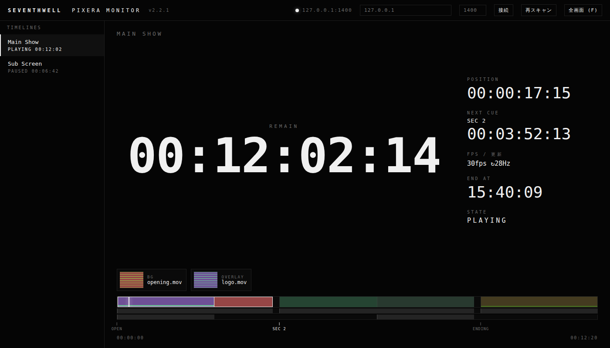

# SW PIXERA Monitor

Read-only status monitor for AV Stumpfl PIXERA live show playback, by [SEVENTHWELL](https://seventh-well.com).

A standalone tool that connects to a PIXERA server over LAN and puts a big, readable
countdown on any screen in the room — laptop, tablet, or a spare monitor at FOH.

**Single Python file with no dependencies** (standard library only) and serves a
browser UI, so any device on the same network can watch the same numbers.



## Why

During a show you often need to know one thing from across the room: **how much time is left.**
The operator's screen is busy, the console is at the other end of the venue, and the director
just wants a number. This tool puts that number on a screen, in a font you can read from
ten meters away.

## Features

- **Big REMAIN readout** in `HH:MM:SS:FF`, amber at 60 s, red at 10 s
- **30 Hz polling** with smooth 60 fps interpolation — no visible stepping
- **Now Playing** — what is actually on screen right now, per layer
- **Timeline overview** with playhead and cue markers
- **Multi-device** — monitor several PIXERA servers at once (main + backup)
- **Browser UI** — open `http://<host>:8770` from a tablet at the desk
- **Bitfocus Companion** integration — push remaining time into custom variables and show it
  on a Stream Deck button
- **Fullscreen focus mode** (`F`) — just the numbers, nothing else
- **Read-only**: this tool never sends transport or control commands

## Requirements

- Python 3.8+ (Windows, macOS, Linux)
- Network access to the PIXERA server
- No `pip install` needed

## Quick start

```bash
python sw_pixera_monitor.py --host 192.168.0.220 --console

# Try it without hardware — ships with a built-in dummy server
python sw_pixera_monitor.py --demo
```

On Windows, double-click `SW-PIXERA-MONITOR.bat` for a small settings window (no console).

See [README.ja.md](README.ja.md) for the full setup guide, including the PIXERA-side API
configuration and Companion/Stream Deck integration (Japanese).

## Protocol notes

Written from the vendor documentation and verified against real hardware. The details that
cost the most time to work out:

PIXERA — JSON-RPC 2.0 over TCP with a `0xPX` delimiter. There is no fixed default API
port; you assign one in *Settings → API* (docs use 1400) and **PIXERA must be restarted**
for the change to apply. Three framings exist in the wild (`dl` delimiter, `pxr1` length
header, and HTTP POST); this tool detects which one the server speaks. The API returns no
video or audio data, so scopes and waveforms are not possible.

## License

MIT — see [LICENSE](LICENSE).

## Disclaimer

Not affiliated with, endorsed by, or supported by AV Stumpfl GmbH or Bitfocus AS.
PIXERA, Stream Deck, and Companion are trademarks of their respective owners.
This tool is a read-only monitor built against publicly documented APIs. Test it in your
own rig before relying on it in a show.
